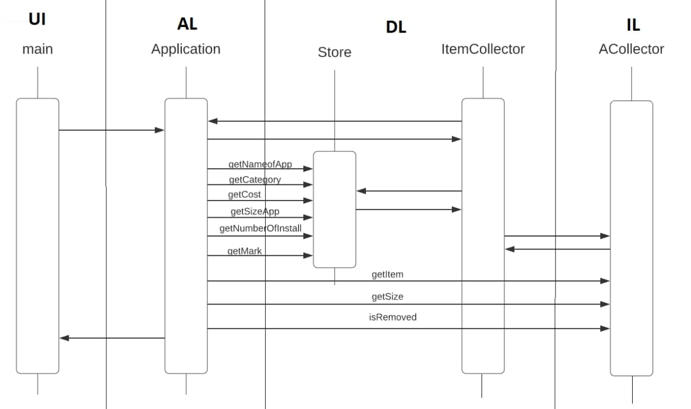

## Описание задания

"Магазин приложений".

Постройте диаграмму последовательности выполнения команды view. Диаграмма должна показывать прохождение выполнения команды между программными объектами, расположенными в соответствующих слоях многоуровневой архитектуры.

## Диаграмма последовательности

Последовательность выполнения команды view:

